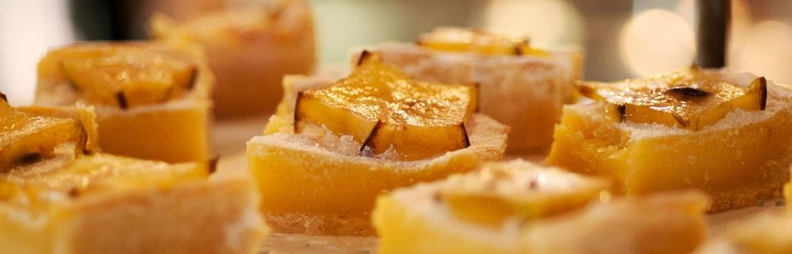

# _Independent Project #7: Pierre's Bakery_

#### Contributors: _**Claire Thorington**_

#### _A page demonstrating new skills in C# and .NET!_

## Technologies Used

* Markdown
* C#
* .NET

## Description

A user is welcomed to Pierre's Bakery and asked how many loaves of bread and how many pastries they'd like to order. The application returns the total cost of their order, given the following pricing structure:
* Bread: Buy 2, get 1 free (every 3rd loaf of bread is free.). A single loaf costs $5, two loaves costs $10, and three loaves cost $10.
* Pastry: Buy 1 for $2 or 3 for $5. Four pastries costs $7, five pastries costs $9, and six pastries costs $10.

## Setup/Installation Requirements

* Clone repository to desktop
* Follow the steps on this page to install C# and .NET on your computer: [(https://www.learnhowtoprogram.com/c-and-net/getting-started-with-c/installing-c-and-net)]
* Navigate to the __Program.cs__ file in your terminal
* To run program, type _$ dotnet run_
* To run tests, navigate to the __Bakery.Tests__ folder in your terminal and type _$ dotnet test_

## Known Bugs

* No known bugs

## License

[<a href=LICENSE>MIT</a>]

Copyright (c) _2022_ _Claire Thorington_
